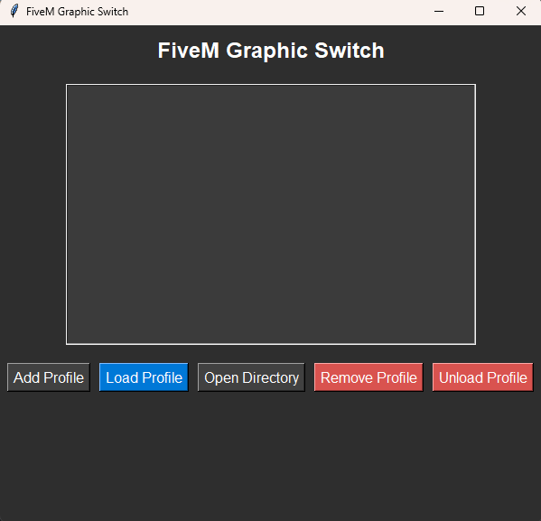

# 🎮 FiveM Graphic Switch 🚀

> **A simple program to manage and load custom graphic profiles for FiveM!**

[](https://www.python.org/)
[](https://wiki.python.org/moin/TkInter)
[](LICENSE)

---

## 📖 Description

**FiveM Graphic Switch** is a GUI-based utility designed to easily manage and load custom graphic profiles for FiveM, the popular multiplayer framework for Grand Theft Auto V, available exclusively on **Windows**.

⚙️ **Main Features**:
- 🌟 **Multi-profile management**: Create, edit, and manage multiple graphic profiles.
- 🖱️ **User-friendly interface**: Intuitive design with clearly labeled buttons for every action.
- 🗑️ **Clean transitions**: Remove or "unload" active profiles when needed.
- 📂 **Profile folder integration**: Quickly access profile directories.

---

## 📦 Installation

Follow these steps to set up and run the program:

1. **Download the Installer**:
   - Go to the [Releases](https://github.com/yourusername/fivem-graphic-switch/releases) section of this repository.
   - Download the latest version of the installer (`FiveM-Graphic-Switch-Installer.exe`).

2. **Run the Installer**:
   - Execute the downloaded file and follow the instructions to complete the installation.

3. **Launch the Program**:
   - After installation, run the program from the shortcut or the installation directory.

---

## ✨ How to Use the Program

### 1️⃣ **Initial Setup**
Upon first launch, you’ll be asked to select the FiveM installation directory. This directory will then be saved for future use.

### 2️⃣ **Add a Profile**
1. Click the **Add Profile** button.
2. Enter a name for your new profile.
3. The program will automatically create a folder structure (`mods`, `plugins`, `citizen`) for your profile.

### 3️⃣ **Load a Profile**
1. Select a profile from the list in the center of the window.
2. Click **Load Profile** to apply the graphic files from the selected profile.

### 4️⃣ **Unload the Current Profile**
Click **Unload Profile** to remove the currently active graphic files from the FiveM directory. This helps keep your installation clean.

### 5️⃣ **Remove a Profile**
1. Select a profile you want to delete.
2. Click **Remove Profile**. You’ll be asked to confirm if you want to delete the profile and its folder.

---

## 🖼️ Interface Screenshot

Below is how the **FiveM Graphic Switch** program interface looks:



---

## 🚀 Contributing

If you’d like to contribute to this project:
1. Fork this repository.
2. Create a new branch for your feature:
   ```bash
   git checkout -b feature-your-feature-name
   ```
3. Submit a pull request!

---

## ❓ FAQ

### ❔ Can I use this program on MacOS or Linux?
**No.** This program is designed specifically for **FiveM**, which only runs on **Windows**. You must use a Windows machine to run the program.

### ❔ How can I modify the FiveM directory path?
You can delete the `config.json` file generated by the program. The directory selection dialog will open again on the next launch.

### ❔ Are the graphic files from an active profile overwritten during loading?
Yes, when loading a new profile, any existing graphic files are cleaned up before copying the new ones to the FiveM directory.

---

## 📝 License

This project is licensed under the **MIT License**. Feel free to use, modify, and distribute it as needed.

---

## 💻 System Requirements

- Windows OS (required).
- No external Python dependencies (Tkinter is built-in).
- Installer provided as `.exe` on the [Releases](https://github.com/yourusername/fivem-graphic-switch/releases) page.

---

## 📢 Contact

If you have any questions or want to report an issue, feel free to contact me directly on [GitHub](https://github.com/yourusername).

---

> *Created with ❤️ using Python!*